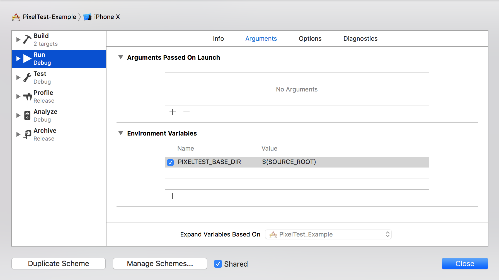

# PixelTest

[](https://travis-ci.org/KaneCheshire/PixelTest)
[](http://cocoapods.org/pods/PixelTest)
[](http://cocoapods.org/pods/PixelTest)
[](http://cocoapods.org/pods/PixelTest)

PixelTest is a modern, Swift-only snapshot testing tool.

Snapshot testing compares one of your views rendered into an image, to a previously recorded image, allowing for 0% difference or the test will fail.

Snapshot tests are perfect for quickly checking complex layouts, while at the same time future proofing them against accidental changes.

Unlike other snapshot testing options, PixelTest supports declaring which resolution to record your snapshots in, so it doesn't matter which simulator you run your snapshot tests on.

As an added bonus, PixelTest also clears up after itself. If you fix a failing test, the failure and diff images are automatically removed for you.

## Why snapshot test?

Snapshot tests are an excellent (and super fast) way to ensure that your layout never breaks. We cover logic with unit tests, and behaviour with automation/UI tests, and snapshot tests cover how the app actually looks. It ensures that complex layouts aren't broken from the start, which means less time going back and forth running the app, but also means you or anyone else is free to refactor a view without fear of breaking the way it looks.

## Usage

### Step 1

First things first, you need to tell PixelTest where to store reference images. To do this, in Xcode click on:

[your scheme name] > [edit scheme...] > [Run] > [Arguments]



And then add a new environment variable named `PIXELTEST_DIR` with a value of something like `$(SOURCE_ROOT)/Snapshots`.

PixelTest will store all reference, failure and diff images in here for testing. I'd like to be able to support storing snapshots in multiple locations (for example if you've got multiple modules/subprojects), so if you have any ideas please raise an issue!

### Step 2

Next you'll want to create a unit test case **(not a UI test case, this is important!)**, and then subclass `PixelTestCase`:

```swift
import PixelTest

class TestClass: PixelTestCase {

}
```

### Step 3

Start writing some tests. Check out the example project for some simple examples! Once you've written your tests, you'll need to first record some reference images. To record images, override `setUp()` and set `mode` to `.record`:

```swift
class TestClass: PixelTestCase {

  override func setUp() {
    super.setUp()
    mode = .record
  }

  func test_someViewLaysOutProperly() throws {
    let view = MyCustomView()
    // ... magic code that lays out your view .. //
    try verify(view)
  }

}
```

Once you've overridden `setUp()`, simply run your tests. Each test that runs while `mode` is set to `.record` will record a reference image. Once you disable record mode (either by removing the line of code or by setting `mode` to `.test`), each subsequent run of your tests will check the saved reference image. If even 1 pixel is different, the test will fail.

If a test fails, you'll find two images in the `Diff` and `Failure` directories (in the directory you set up in the first step). You can use these images to see what's changed and what went wrong. If it was an intentional change, you can re-record your snapshots. Be careful to only run the tests you want to re-record in record mode, because it will overwrite any tests that run.

## Known issues

PixelTest might not work properly with reusable views like `UITableViewCell`s and `UITableViewHeaderFooterView`s. If you have any issues and figure out a fix please raise an issue or PR.

## Requirements

PixelTest currently only works in iOS projects.

## Author

@KaneCheshire, [kane.codes](http://kanecheshire.com)

## License

PixelTest is available under the MIT license. See the LICENSE file for more info.

The original idea for snapshot testing was FBSnapshotTest which was deprecated and later inherited by Uber. PixelTest is a much Swiftier alternative, with less overhead and easier to follow open-source code.
